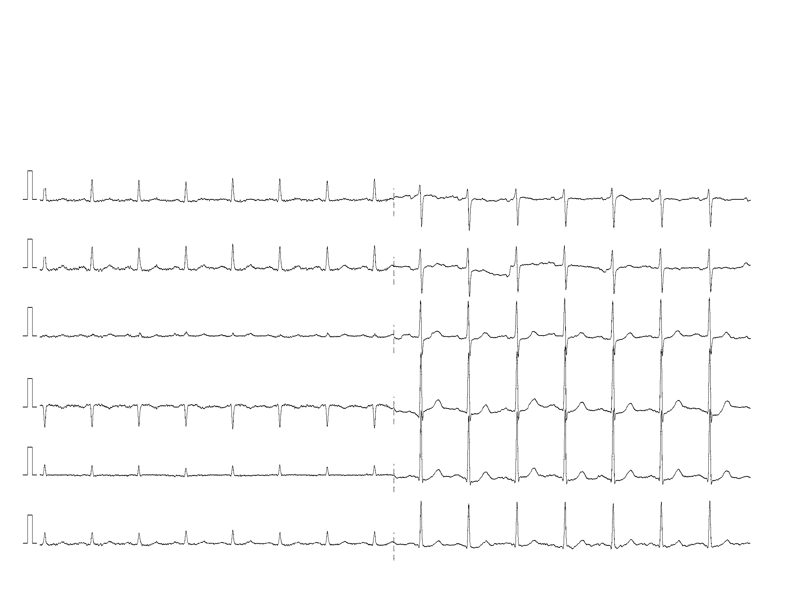
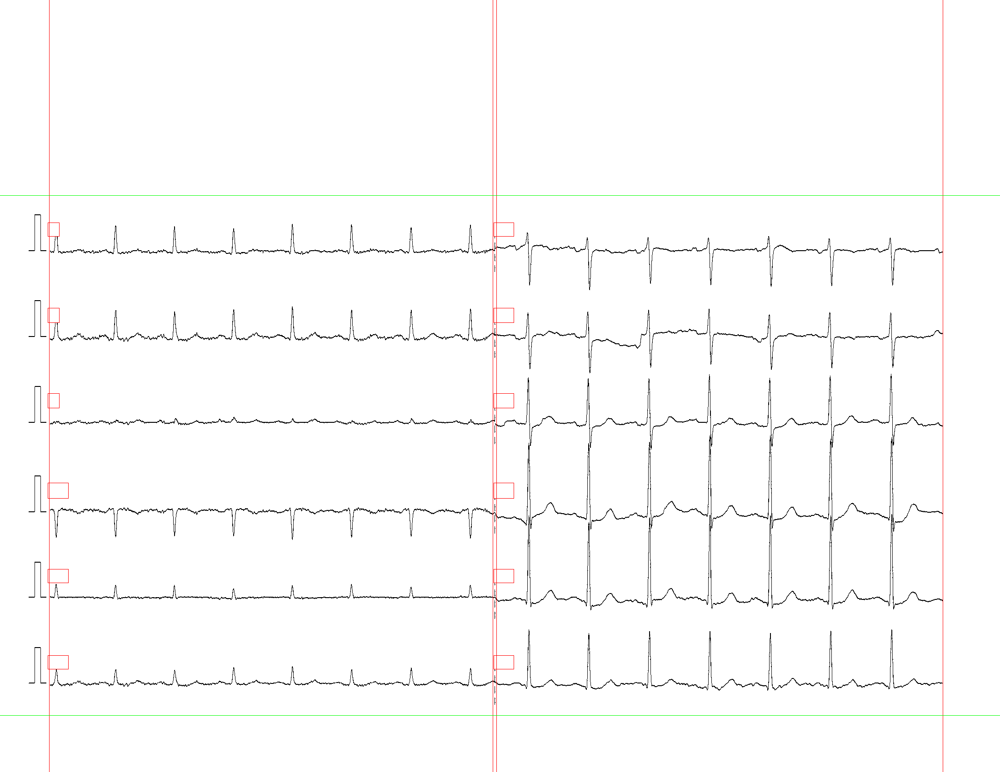
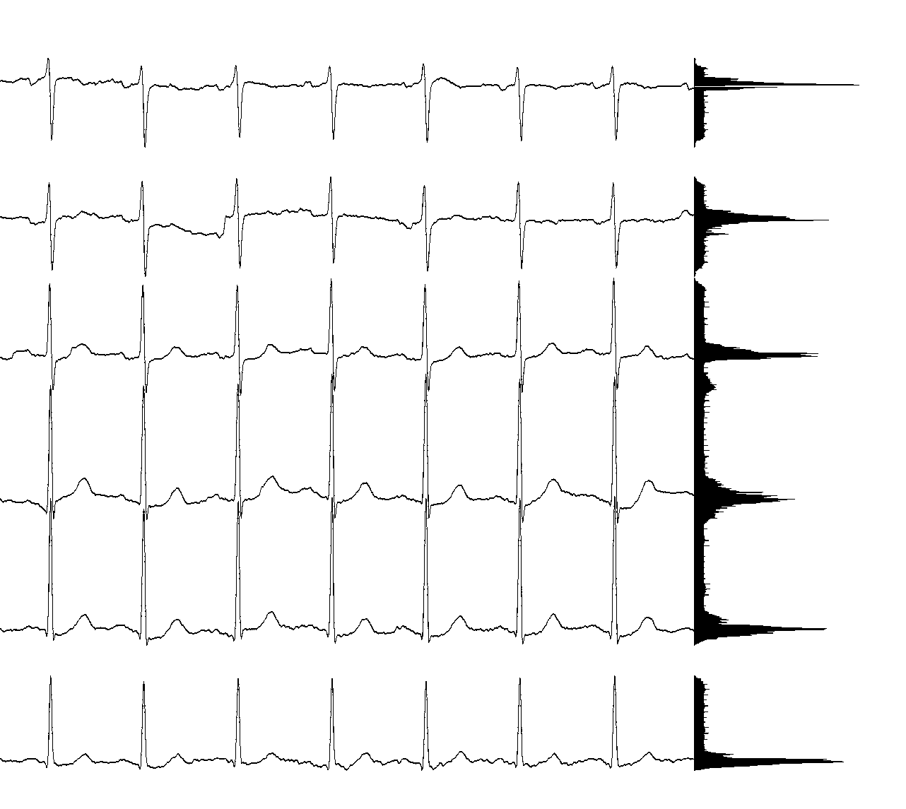
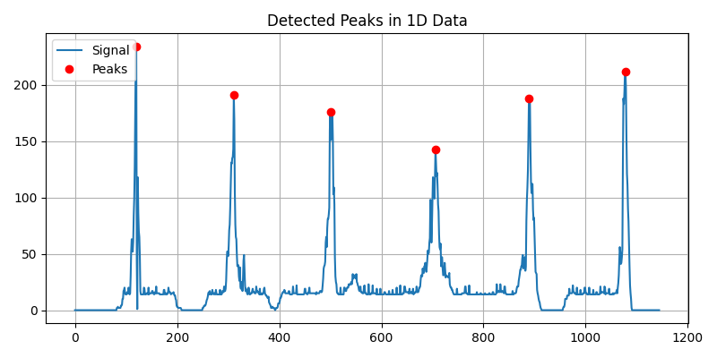
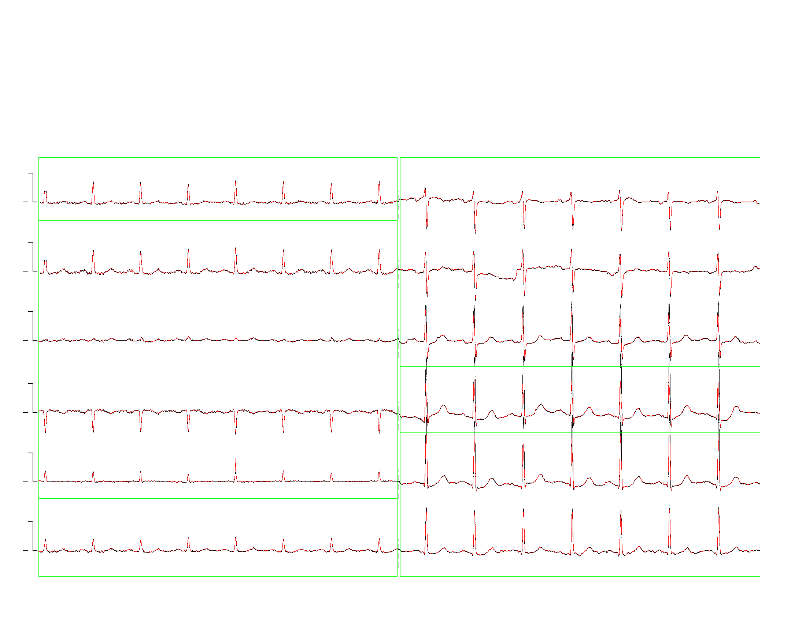

# 1、Introduction
This project focuses on digitizing fixed-layout, pre-cleaned ECG images. It specifically addresses the challenge of signal overlap (adhesion) between leads by employing a QRS complex reconstruction method to restore the obscured waveforms.

# 2、 Pipeline Overview
## 1、Background Removal
Currently, a threshold-based method is used to remove the background.

 - Future Work: This can be improved by integrating deep learning approaches, such as U- Net or VLMs (Vision-Language Models), for more robust background extraction.

## 2、Manually locate boundaries and remove lead names 
The system currently uses manual coordinates to locate lead boundaries and mask lead names.

 - Optimization: This step is a candidate for automation. Future updates could implement object detection models (e.g., YOLO) to automatically detect and crop lead regions.

## 3、Signal Separation & Overlap Detection
Lead positions and potential overlaps are identified by analyzing pixel histograms. By calculating the sum of pixel values along columns, we can detect peaks and valleys to determine boundaries.

Figure: Signal Overlap Detection

Detection Logic: If the pixel value at a detected valley is non-zero, it indicates that signal overlap (adhesion) has occurred.

## 4、Boundary positioning visualization
Below is the visualization of the determined boundaries.

Note: Positioning accuracy may decrease in areas with severe signal overlap.

## 5、Digitalization
The digitization process involves two strategies:

1. Non-overlapping segments: Directly reconstructed from pixel data.

2. Overlapping segments: Reconstructed using the QRS wave reconstruction method.

# 3、Usage
Prerequisites

 - Ensure all dependencies are installed.

Scripts

 - pdf_to_image.py Converts source ECG files from PDF to PNG format. • Batch Processing:

 - 6x2_dig.py : Script for processing 6x2 layout ECGs.

 - 3x4_dig.py : Script for processing 3x4 layout ECGs.

Visualization & Experiments

 - 6x2_ dig. ipynb A Jupyter Notebook containing step-by-step visualizations of the main pipeline. It includes experimental code for handling signal overlap.

 If you have better solutions for resolving ECG signal overlaps, please feel free to share.

